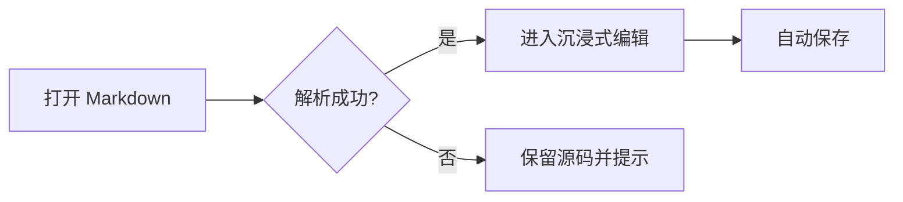

# Nolia Lite Markdown 全元素验收

这份文档用于页面级验收，不是产品说明。请在 Nolia Lite 中直接打开，并依次检查排版、光标、选择、局部源码编辑、保存与重新打开后的结果。

普通段落应保持安静、连续的阅读节奏。中文、English、数字 0123456789 与标点（全角），punctuation (half-width) 混排时，字面基线、字重和行距不应跳动。这个长段落用于观察自动换行：Nolia Lite 是一个轻量级、单文档、本地优先的 Markdown 编辑器，正文应当占据窗口的主要空间，同时保持足够但不过量的阅读宽度。

## 二级标题：块级层级

### 三级标题

#### 四级标题

##### 五级标题

###### 六级标题

点击任意标题后，光标应直接进入标题文本；当前标题所需的 `#` 标记按光标位置显现，不创建独立源码输入框。标题等级可通过对应快捷键或原生菜单调整。

## 行内格式与包裹字符

基础格式包括 **~~粗体文字~~**、*斜体文字*、~~删除线文字~~、`inlineCode()` 和 [相对链接](./UI_UX_SPEC.md)。

组合格式包括 ***粗斜体***、**粗体中的 *斜体***、~~删除线中的 **粗体**~~，以及 **包含 `inlineCode()` 的粗体**。光标进入具体格式后，应只显现当前范围的 `**`、`*`、`~~` 或反引号标记，其余段落继续保持渲染态。

格式可通过选区工具条、快捷键或源码模式修改；完成后应立即恢复连续排版，且不改变无关文本。

需要原样显示的转义字符：\*不是斜体\*、# 不是标题、反斜杠 `C:\Users\Nolia\note.md`。

硬换行测试：这一行末尾有两个空格。  
下一行应另起一行，但仍属于同一段落。

## 引用与分隔线

> 一级引用保持克制的左边线与缩进，不应出现卡片背景。
>
> > 嵌套引用用于检查多层缩进。
> >
> > 第二段包含 **粗体** 与 `code`。

---

分隔线上下留白应清晰，但不应切断整篇文档的阅读连续性。

## 列表与任务

- 无序列表第一项
- 无序列表第二项，包含较长文字以检查换行后的悬挂缩进是否与正文起始位置对齐
  - 二级嵌套项目
    - 三级嵌套项目
- 无序列表末项

1. 有序列表第一项
2. 有序列表第二项
  1. 嵌套有序项目
  2. 第二个嵌套项目
3. 有序列表末项

- [x] 已完成任务
- [ ] 未完成任务
- [ ] 包含 **强调文字** 和 [链接](https://example.com) 的任务

## 表格：紧凑内容

下面的普通表格应占用正文宽度，并依据内容自动分配列宽；文字、数值与状态应容易横向扫描。


| 名称    | 数量  | 状态  |
| :----- | ---: | :---: |
| Alpha | 7   | 正常  |
| Beta  | 128 | 待处理 |
| Gamma | 3   | 完成  |

## 表格：混合内容与换行


| 类型   | 示例                                                                                                                               | 验收重点            |
| :---- | :-------------------------------------------------------------------------------------------------------------------------------- | :--------------- |
| 中英文  | Nolia Lite 文档编辑器                                                                                                                 | 字体基线一致，不出现异常加粗  |
| 行内代码 | `npm run verify`                                                                                                                 | 灰底不应撑高整行，左右间距紧凑 |
| 长文本  | 这是一段会在单元格内自然换行的中文说明，用于检查行高、换行和垂直对齐                                                                                               | 不截断，不溢出，不逐字断行   |
| 长英文  | [antidisestablishmentarianism@example.invalid](mailto:antidisestablishmentarianism@example.invalid)/path/to/a/very/long/resource | 必要时断行，不撑破画布     |
| 行内格式 | **粗体**、*斜体*、~~删除线~~                                                                                                              | 单元格内格式与正文一致     |

## 表格：宽内容与多列

下面的宽表应在自己的区域内横向滚动，不应让整个文档或窗口出现水平滚动。


| ID   | 负责人  | 模块   | 优先级 | 开始日期       | 截止日期       | 当前状态 | 构建版本    | 验收环境         | 备注          |
| ----: | :---- | :---- | :---: | :----------: | :----------: | :---- | :------- | :------------ | :----------- |
| 1001 | Lin  | 编辑器  | P0  | 2026-07-21 | 2026-07-27 | 进行中  | `0.1.0` | macOS 15     | 检查表格密度与横向滚动 |
| 1002 | Chen | 文件桥接 | P1  | 2026-07-22 | 2026-07-30 | 待验收  | `0.1.0` | Windows 11   | 检查原生窗口与文件关联 |
| 1003 | Wang | 发布流程 | P1  | 2026-07-23 | 2026-08-01 | 未开始  | `0.1.0` | Ubuntu 24.04 | 检查系统字体回退    |

## 代码

行内代码 `const answer = 42` 应与正文保持同一基线，背景只形成轻微区分。

```typescript
type DocumentState = {
  filePath?: string;
  dirty: boolean;
};

export function displayName(state: DocumentState): string {
  return state.filePath?.split("/").at(-1) ?? "未命名";
}
```

```bash
npm run verify
npm run tauri:build
```

```text
未知语言或纯文本应回退为无高亮的等宽文本。
制表符、空格和很长的一行都不应改变正文画布宽度。
```

## 图片

本地图片应按原比例显示，且不超过正文宽度：


缺失图片应显示稳定占位，不应导致白屏：


远程图片不主动加载，应显示受控占位：


## 公式

行内公式 $a^2 + b^2 = c^2$ 应与正文基线对齐，点击后可编辑带 `$` 的局部源码。

$$
\sum_{i=1}^{n} i = \frac{n(n+1)}{2}
$$

## Mermaid 流程图



## Mermaid 时序图

```sequenceDiagram
sequenceDiagram
  participant U as 用户
  participant E as 编辑器
  participant F as 本地文件
  U->>E: 修改标题等级
  E->>E: 更新局部 Markdown 节点
  E->>F: 安全保存
  F-->>E: 返回新指纹
  E-->>U: 恢复排版视图
```

## 安全 HTML

<section><strong>安全 HTML 预览</strong><p>这里的结构允许显示，但事件处理器和脚本绝不能执行。</p></section>

<script>alert("这段脚本不得执行")</script>

## 脚注

正文中的脚注引用应保持轻量，不抬高整行[^layout]。第二个脚注用于检查长文本换行[^long-note]。

[^layout]: 脚注定义应可局部编辑，并与正文之间保持清晰但紧凑的间距。
[^long-note]: 这是一条较长的脚注定义，包含 **粗体**、`行内代码` 和 [链接](./TECHNICAL_DESIGN.md)，用于检查复杂行内元素的保存保真。

## 受保护语法

下面的 Wiki Link 超出 Lite 产品边界，必须原样保留为受保护源码，不能静默删除：

[[Nolia 工作区中的双向链接]]

## 页面末尾

最后一个段落用于检查底部留白。点击文档末尾空白时，应能把光标放到最后一个可编辑段落；临时工具条、表格菜单和局部源码输入都不能遮挡正文。
